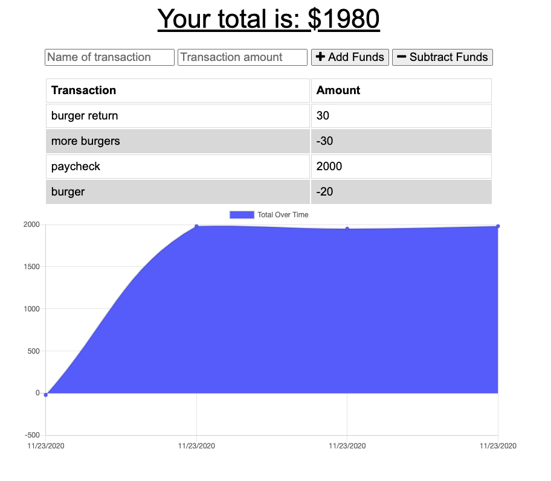

  
  
  
  # Katie's Money | Budget Tracker
  ## Description
  #### As a user, I am able to track my deposits and expenses even when I am not connected to the internet. Who remembers when you had to balance your checkbook because banks didn't have an online portal that would keep track. This is JUST like that, but we can do this online or offline. All transactions will be up to date when the connection is back online.
  # Table of Contents
   * [Installation](#installation)
   * [Usage](#usage)
   * [License](#license)
   * [Contributors](#contributors)
   * [Tests](#tests)
   * [Questions](#questions)
  ## Installation
  #### bootstrap, express, mongoose, router
  ## Usage
 
  
  
  ###

  #### See Video of Usage Here:
  https://drive.google.com/file/d/1S8tZqIxWhwBelZMPCASP4m8S4xeOJiYf/view
  #### See Fully Deployed App on Heroku:
  https://katiesmoney.herokuapp.com/
  ## License
  #### This project is licensed under the MIT license.
  ## Contributing
  #### 
  ## Test
  #### 
  ## Questions
  #### Email: <a>kanilionis@gmail.com</a>
  #### GitHub: <a>github.com/kanilionis</a>
  